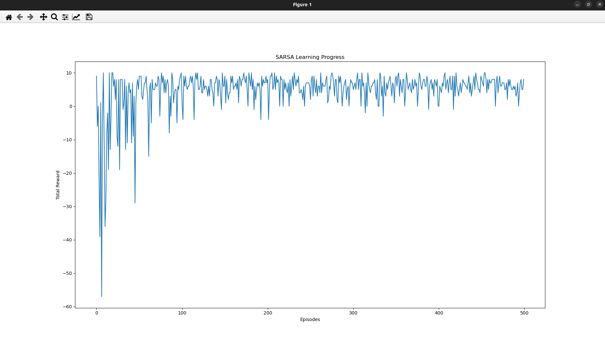

# SARSA Learning Visualization

This project implements a **SARSA (State-Action-Reward-State-Action)** reinforcement learning algorithm and provides a **PyQt-based visualization** of the learning process. The visualization includes a grid representing spatial relations and objects, with the agent's movement and learning progress displayed in real-time.

## Features

- **SARSA Learning Algorithm**: Implements the SARSA algorithm to learn optimal policies in a grid-based environment.
- **Interactive Visualization**: A PyQt-based GUI that visualizes the agent's movement, rewards, and learning progress.
- **Customizable Goal**: Users can set a custom goal for the agent using a graphical interface.
- **Learning Progress Plot**: After training, the total reward per episode is plotted using Matplotlib.

## Requirements

To run this project, you need the following Python packages:

- `numpy`
- `PyQt5`
- `matplotlib`

You can install the required packages using pip:

```bash
pip install numpy PyQt5 matplotlib
```

## How to Use

1. **Clone the Repository**:
   ```bash
   git clone https://github.com/your-username/sarsa-learning-visualization.git
   cd sarsa-learning-visualization
   ```

2. **Run the Program**:
   Execute the `SARSA_visual.py` script:
   ```bash
   python SARSA_visual.py
   ```

3. **Enable Visualization**:
   When prompted, type `yes` to enable the PyQt visualization. The program will open a window showing the grid and the agent's movement.

4. **Set the Goal**:
   - A dialog will appear allowing you to select a **spatial relation** and an **object** as the goal.
   - Click **OK** to confirm the goal.

5. **Observe the Learning Process**:
   - The agent will start learning and moving in the grid.
   - The grid will update in real-time, showing the agent's current position and the goal state.

6. **View the Learning Progress**:
   After training, a Matplotlib plot will show the total reward per episode, allowing you to analyze the learning progress.

7. **Without Visualization**:
   If you choose not to enable visualization, the program will run in the console, and the learning progress will be plotted after training.

## Code Structure

- `SARSA_visual.py`: The main script that implements the SARSA learning algorithm and the PyQt visualization.
- `SARSA.py`: Contains the SARSA learning logic, including the `train` function and environment setup.

## Example Workflow

1. **With Visualization**:
   ```
   Do you want to enable visualization? (yes/no): yes
   ```
   - The `GoalDialog` window pops up, allowing you to select the goal position.
   - The PyQt window shows the grid with the agent's movement.
   - When the training is complete, a Matplotlib plot shows the learning progress.

2. **Without Visualization**:
   ```
   Do you want to enable visualization? (yes/no): no
   ```
   - The goal is set using the console input.
   - Only the reward history graph is shown after training.

## Screenshots

### PyQt Visualization


### Learning Progress Plot

